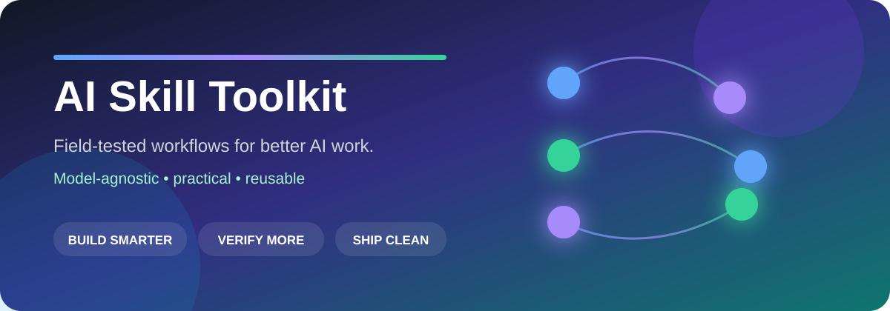

<p align="center">
  
</p>

<p align="center">
  <strong>A curated collection of AI skills and workflows that earned their place by solving real problems.</strong>
</p>

<p align="center">
  
  
  
  
</p>

---

## Not a giant prompt dump

This is my **greatest-hits shelf**: reusable instructions and workflows that survived actual work and solved a problem worth solving again.

The goal is simple:

> **Make AI more useful without making the workflow more complicated.**

The collection is deliberately model-agnostic. A skill may run directly in ChatGPT, Claude, Codex, Gemini, another agent, or simply serve as a well-structured instruction file where native skill support is unavailable.

## Featured release

<table>
<tr>
<td width="62%" valign="top">

### 🔄 Agent Build Continuity

**Stop multiple AI agents from unknowingly rebuilding, overwriting, or losing the same project.**

If you use more than one AI tool—or even multiple sessions of the same tool—this creates a lightweight coordination layer around:

- build identity
- canonical project location
- temporary ownership
- handoff / restart cards
- agent-to-agent relay messages
- duplicate-build prevention

It works with an existing project tracker, database, shared document, GitHub repo, or a simple file-based fallback. It does **not** require a particular model, cloud provider, operating system, or proprietary registry.

**Best for:** people who bounce between AI coding/build tools and are tired of reconstructing context or discovering that 2 agents worked on the same thing.

</td>
<td width="38%" valign="top">

#### Get it

**[⬇️ Download `skill.zip`](downloads/agent-build-continuity/skill.zip)**

**[📖 View the skill](skills/agent-build-continuity/SKILL.md)**

**[🧩 Setup patterns](skills/agent-build-continuity/references/setup-patterns.md)**

**[🗂️ State format](skills/agent-build-continuity/references/state-format.md)**

</td>
</tr>
</table>

### The idea in 20 seconds

```text
Agent A starts work
        │
        ▼
checks shared build identity + owner
        │
        ├── someone else owns it ──► coordinate, don't duplicate
        │
        └── available ─────────────► claim + work
                                         │
                                         ▼
                                  leave restart card
                                         │
                                         ▼
                                   Agent B continues
```

The continuity record coordinates the agents. **It does not replace the real source of truth for the project.**

---

## What belongs here

Every release should clear 4 bars:

| Standard | Meaning |
|---|---|
| **Useful** | It fixes a real workflow problem, not an invented one. |
| **Portable** | It can be adapted across models and platforms. |
| **Opinionated** | It tells the AI what to *do*, not just what to think about. |
| **Proven** | It has been used or pressure-tested enough to justify sharing. |

That means this repo will stay smaller than the average “1000 prompts” collection on purpose.

## On deck

These are the kinds of workflows I expect to publish as they are generalized and cleaned for public use. **They are not released until they meet the standards above.**

| Lane | What it solves | Status |
|---|---|---|
| 🐇 **Rabbit Hole Guard** | Detect when a build/integration is becoming a time sink; prove the kill-shot dependency first. | Planned |
| ✅ **Production Preflight** | Verify platform constraints before spending time or money producing something that will fail at upload/deploy. | Planned |
| 🧭 **Decision Pressure Test** | Challenge assumptions and identify what would actually change a consequential decision. | Planned |
| 🧠 **Source-of-Truth Discipline** | Keep long-running AI projects grounded in current canonical sources instead of stale chats and memory. | Planned |
| 🛠️ **Build Handoff** | Make another AI or human able to resume a project without chat archaeology. | Planned |

The names may change. The problems are the point.

---

## How to use these

### If your AI supports Skills

Download the relevant `skill.zip` and install/upload it through that product's skill workflow.

### If it supports project instructions but not Skills

Open the skill's `SKILL.md` and use the relevant instructions in your project's persistent rules or instruction file.

### If you're using a coding agent

Keep the skill close to the repo and let the agent load it when the workflow applies. Exact installation varies by platform, but the underlying instructions are plain text by design.

> **Security note:** always inspect a downloaded skill before installing it. A skill is executable operating guidance for an AI agent, not just a document.

---

## Why I built this

I use AI across real business, software, automation, education, and consulting work. Once you use several models and agents at the same time, a new class of problems appears: duplicated builds, context drift, confident assumptions, long technical rabbit holes, and “finished” work that was never actually verified.

These skills are the workflows I wish the AI had followed *before* those problems happened.

They are intentionally practical. If a rule adds ceremony without improving the outcome, it does not belong here.

---

## Repository structure

```text
ai-skill-toolkit/
├── README.md
├── assets/
│   └── hero.svg
├── downloads/
│   └── agent-build-continuity/
│       └── skill.zip
└── skills/
    └── agent-build-continuity/
        ├── SKILL.md
        ├── agents/
        │   └── openai.yaml
        └── references/
            ├── setup-patterns.md
            └── state-format.md
```

Future releases follow the same pattern so the main README stays a clean catalog rather than becoming the instruction manual for every skill.

## Compatibility philosophy

The skills should describe **capabilities and workflow roles**, not hard-code brand loyalty.

Good:

> Use the project's shared repository or coordination surface.

Bad:

> You must use Vendor X's database, Model Y, and Tool Z.

Specific integrations belong in optional setup examples—not in the core idea unless the integration itself is the point of the skill.

## Contributing

This is curated rather than crowdsourced, but bug reports, edge cases, portability issues, and thoughtful improvements are welcome through GitHub issues once the repository is live.

## License

MIT. Use it, adapt it, teach with it, build on it.

---

<p align="center">
  <strong>Better AI is often less about another model and more about a better way of working.</strong>
</p>
